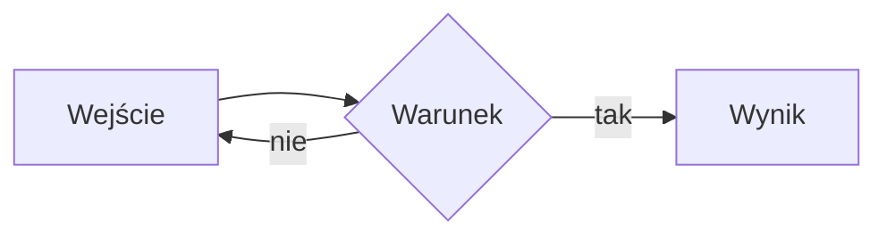

# Generowanie publikacji — książki, artykuły, raporty

> **Cel tego dokumentu.** To jest prompt/specyfikacja dla modelu AI, który ma wygenerować
> gotową publikację w trzech formatach: **Markdown** (źródło), **PDF** (skład) i **EPUB**
> (czytnik). Opisuje układ, budowę i typografię — nie treść. Treść przychodzi osobno.
>
> **Wzorzec typograficzny:** książki Donalda Knutha (*The Art of Computer Programming*,
> *Computers & Typesetting*). Nie chodzi o naśladowanie wyglądu Computer Modern za wszelką
> cenę, tylko o **zasady**, które za tym wyglądem stoją — są wypisane w §3.
>
> **Cel czytania:** Kindle Paperwhite. Parametry strony w §7 są policzone pod jego ekran.

---

## 0. Zasady nadrzędne

Trzy reguły, które unieważniają wszystkie pozostałe, gdy wejdą w konflikt:

1. **Źródłem prawdy jest Markdown.** PDF i EPUB powstają z niego automatycznie. Nigdy nie
   generuj trzech dokumentów osobno — rozjadą się przy pierwszej poprawce. Jeśli czegoś nie
   da się wyrazić w Markdownie, wyraź to w metadanych albo w bloku, który konwerter rozumie.

2. **Nie wymyślaj treści, której nie masz.** Dotyczy to zwłaszcza **cytowań i ilustracji**.
   Fałszywy przypis wygląda dokładnie jak prawdziwy i jest gorszy niż jego brak — czytelnik
   nie ma jak go odróżnić. Zasady w §6.4 i §6.1.

3. **Pusty element jest lepszy niż zmyślony.** Brak indeksu jest widoczny i naprawialny;
   indeks z wymyślonymi numerami stron psuje zaufanie do całej książki.

---

## 1. Formaty wyjściowe i sposób ich wytwarzania

### 1.1 Pipeline

```
źródło.md  ──pandoc──▶  PDF   (przez LaTeX: xelatex/lualatex)
           ──pandoc──▶  EPUB3
           ──(sam)───▶  Markdown do czytania w repozytorium
```

Wymagane narzędzia (**nie są zainstalowane domyślnie** — sprawdź przed generowaniem):

```
pandoc          konwersja                brew install pandoc
xelatex         skład PDF                brew install --cask mactex-no-gui
                                         (albo tectonic — lżejszy, bez pełnego TeX Live)
```

Polecenia w §8.

### 1.2 Co jest różne w każdym formacie

| Cecha | Markdown | PDF | EPUB |
|---|---|---|---|
| Numery stron | brak | są | brak (paginacja czytnika) |
| Spis treści | lista linków | `\tableofcontents` z numerami | nawigacja NCX/nav |
| Indeks | lista haseł z linkami | numery stron | linki do miejsc |
| Przypisy | na końcu sekcji | u dołu strony | wyskakujące |
| Szerokość kolumny | zmienna | stała, §7 | zmienna |
| Ilustracje | ścieżki względne | osadzone | osadzone |

**Konsekwencja praktyczna:** nigdy nie pisz w treści „patrz strona 42" ani „w tabeli poniżej".
Numer strony nie istnieje w EPUB-ie, a „poniżej" bywa „na następnej stronie" po przełamaniu.
Odsyłaj **nazwą i numerem elementu**: „patrz rys. 3.2", „twierdzenie 4.1".

---

## 2. Rodzaje publikacji

| Rodzaj | Objętość | Podział | Aparat naukowy |
|---|---|---|---|
| **Książka** | >80 stron | części → rozdziały → podrozdziały | pełny: indeks, bibliografia, słownik, ćwiczenia |
| **Raport** | 10–80 stron | rozdziały → sekcje | streszczenie, bibliografia, załączniki |
| **Artykuł** | 2–15 stron | sekcje numerowane | abstrakt, bibliografia |
| **Notatka** | <2 strony | bez podziału | opcjonalnie źródła |

Rodzaj deklaruje się w metadanych (`documentclass`, §5.1) i **on decyduje o całej reszcie** —
o numeracji, o obecności spisu treści, o tym, czy rozdział zaczyna się od nowej strony.

---

## 3. Typografia w duchu Knutha

To jest sedno tego dokumentu. Knuth nie robił książek „ładnych" — robił je **czytelnymi
w bardzo określony sposób**, i każda decyzja ma uzasadnienie.

### 3.1 Dziewięć zasad, które przenosimy

**1. Akapit oznacza się wcięciem, nie odstępem.** Wcięcie 1 em (u Knutha 20 pt przy tekście
10 pt). Pusta linia między akapitami rozbija stronę na wyspy i marnuje wysokość — na ekranie
Kindle'a wysokość jest najdroższym zasobem. **Pierwszy akapit po nagłówku nie ma wcięcia** —
nie ma od czego go odróżniać.

**2. Jeden krój na tekst, jeden na kod, jeden na matematykę.** U Knutha: Computer Modern
Roman / Typewriter / Math Italic. Nie mieszaj więcej. Pogrubienie służy do **wprowadzania
pojęcia**, kursywa do *podkreślenia* i do tytułów — nigdy odwrotnie.

**3. Interlinia jest stała i wynika z rozmiaru pisma.** TeX: 10 pt na 12 pt (`\baselineskip`),
czyli 1,2. Na ekranie e-ink podnosimy do **1,35** — kreski Computer Modern są cienkie, a przy
gęstym składzie wiersze zlewają się w szarość. To jedyne odstępstwo od proporcji Knutha
i jest świadome.

**4. Wiersz ma 45–75 znaków.** Poniżej oko skacze, powyżej gubi początek następnego wiersza.
Rozmiar pisma dobiera się **do szerokości kolumny**, nie odwrotnie. Wyliczenia w §7.2.

**5. Tekst jest justowany, z dzieleniem wyrazów.** Justowanie bez dzielenia daje rzeki białych
plam — to najczęstszy błąd składu na wąskiej kolumnie. Dla polszczyzny **wymagane** jest
włączenie wzorców przenoszenia (`polski`/`babel`, §8.2).

**6. Twierdzenia, definicje i przykłady są numerowane w obrębie rozdziału.** `4.1`, `4.2` —
nie ciągiem przez całą książkę. Czytelnik po numerze ma wiedzieć, gdzie szukać.

**7. Ćwiczenia mają oznaczony stopień trudności.** To znak firmowy TAOCP i rzecz naprawdę
użyteczna. Skala Knutha (uproszczona do czterech stopni w §4.6):
   - `[00]` — natychmiastowe, w pamięci
   - `[10]` — minuta
   - `[20]` — kwadrans
   - `[30]` — dwie godziny
   - `[40]` — praca domowa na tydzień
   - `[50]` — problem otwarty (badawczy)
   Modyfikatory: `M` — wymaga matematyki, `HM` — wyższej matematyki.

**8. Odpowiedzi do ćwiczeń są w książce, na końcu.** Ćwiczenie bez odpowiedzi jest dla
czytelnika samodzielnego bezużyteczne.

**9. Indeks jest gęsty i rzetelny.** U Knutha indeks to kilkanaście stron na tom, z podhasłami
i odsyłaczami. Zasady w §6.5.

### 3.2 Czego świadomie nie przenosimy

| Cecha Knutha | Dlaczego nie | Co zamiast |
|---|---|---|
| Marginalia (uwagi na szerokim marginesie) | Ekran 4,1″ nie ma marginesu do oddania | Wyróżniony akapit w tekście |
| Bardzo szerokie marginesy zewnętrzne | Strata 30% powierzchni ekranu | Marginesy 15–18 pt, §7.3 |
| Dwukolumnowy indeks | Nieczytelny na wąskim ekranie | Jedna kolumna |
| Ozdobne inicjały | Nie wnoszą nic na e-inku | Zwykły nagłówek |

### 3.3 Krój pisma — decyzja z zastrzeżeniem

Domyślnie **Latin Modern** (`\usepackage{lmodern}`) — to bezpośredni potomek Computer Modern
z pełnym pokryciem znaków diakrytycznych, więc polszczyzna działa bez sztuczek.

**Zastrzeżenie, o którym trzeba wiedzieć:** Computer Modern i Latin Modern to kroje typu
*Didone* — mają bardzo cienkie kreski poziome. Na papierze przy 1200 dpi wygląda to
znakomicie; na e-inku przy 300 ppi z podświetleniem cienkie kreski potrafią **zniknąć**,
zwłaszcza przy małym stopniu pisma. Jeśli wydruk próbny na czytniku wygląda blado, użyj:

```yaml
mainfont: "TeX Gyre Pagella"     # Palatino — grubsze kreski, większy x-height
```

To odstępstwo od Knutha, ale zgodne z jego zasadą nadrzędną: **skład ma służyć czytaniu**.

---

## 4. Budowa książki

Kolejność jest wiążąca. Elementy oznaczone *(opc.)* pomija się, gdy nie ma treści — nie
generuje się pustych.

### 4.1 Materiał wstępny

```
Strona tytułowa          tytuł, podtytuł, autor, rok
Strona redakcyjna (opc.) wydanie, licencja, ISBN
Dedykacja (opc.)         krótka, na osobnej stronie
Spis treści              do poziomu podrozdziału (H3)
Spis ilustracji (opc.)   gdy ilustracji > 10
Spis tabel (opc.)        gdy tabel > 10
Przedmowa                po co ta książka, dla kogo, co trzeba wiedzieć wcześniej
Jak czytać tę książkę    (opc.) ścieżki dla różnych czytelników — bardzo w duchu Knutha
```

### 4.2 Materiał główny

```
Część I                  (opc., gdy rozdziałów > 8)
  Rozdział 1
    1.1 Podrozdział
      1.1.1 Punkt        (najgłębiej — niżej nie schodzimy)
    Ćwiczenia do 1.1
  Podsumowanie rozdziału (opc.)
```

**Rozdział zaczyna się od nowej strony** (`\clearpage`). W PDF-ie zawsze na stronie
nieparzystej dla druku dwustronnego (`\cleardoublepage`) — w EPUB-ie nie ma to znaczenia.

Każdy rozdział otwiera **akapit wprowadzający**: o czym jest, czego wymaga, co czytelnik
będzie umiał na końcu. Nie punktory — proza.

### 4.3 Materiał końcowy

```
Odpowiedzi do ćwiczeń    numeracja zgodna z ćwiczeniami
Dodatki (A, B, C…)       materiał pomocniczy, tablice, wyprowadzenia
Słownik pojęć            §6.3
Bibliografia             §6.4
Indeks                   §6.5
Kolofon (opc.)           czym złożono, jakim krojem — Knuth zawsze to podawał
```

### 4.4 Budowa artykułu

```
Tytuł, autor, data
Abstrakt                 150–250 słów, jeden akapit, bez cytowań
Słowa kluczowe           3–6
1. Wprowadzenie          problem, kontekst, wkład pracy
2…n. Sekcje              rzecz właściwa
n+1. Wnioski             co wynika, czego nie rozstrzygnięto
Bibliografia
Załączniki (opc.)
```

Bez spisu treści, bez indeksu. Sekcje numerowane cyframi arabskimi, maksymalnie dwa poziomy.

### 4.5 Budowa raportu

```
Strona tytułowa
Streszczenie kierownicze  1 strona, wnioski przed uzasadnieniem
Spis treści
1. Cel i zakres
2. Metoda
3…n. Ustalenia
n+1. Wnioski i zalecenia  zalecenia numerowane, każde z uzasadnieniem
Bibliografia
Załączniki                dane surowe, obliczenia, ankiety
```

**Różnica wobec artykułu:** raport zaczyna się od wniosków, nie kończy nimi. Czytelnik raportu
często czyta tylko pierwszą stronę.

### 4.6 Ćwiczenia — składnia

```markdown
### Ćwiczenia

**1.** `[10]` Wykaż, że dla każdego $n \ge 1$ zachodzi …

**2.** `[25][M]` Udowodnij twierdzenie 3.2 bez zakładania …

**3.** `[40][HM]` Rozstrzygnij, czy istnieje …
```

Odpowiedzi na końcu książki, w sekcji `## Odpowiedzi do rozdziału 3`, z tą samą numeracją.

---

## 5. Metadane

### 5.1 Blok YAML — pełny

Każdy plik źródłowy zaczyna się blokiem YAML. To on steruje składem.

```yaml
---
title: "Tytuł publikacji"
subtitle: "Podtytuł, jeśli jest"
author: "Imię Nazwisko"
date: "2026"
lang: pl-PL

# Rodzaj publikacji — decyduje o układzie
documentclass: book        # book | report | article
classoption:
  - 11pt                   # patrz §7.2 — dobrać do szerokości kolumny
  - openany                # rozdziały na dowolnej stronie (e-czytnik)

# Typografia
mainfont: "Latin Modern Roman"
monofont: "Latin Modern Mono"
mathfont: "Latin Modern Math"
linestretch: 1.35          # §3.1 pkt 3
indent: true               # akapity wcięciem, nie odstępem — §3.1 pkt 1

# Strona — wartości pod Kindle, §7
geometry:
  - paperwidth=4.12in
  - paperheight=5.49in
  - margin=0.21in
  - top=0.25in
  - bottom=0.3in

# Spisy
toc: true
toc-depth: 3
lof: false                 # spis ilustracji
lot: false                 # spis tabel

# Bibliografia
bibliography: zrodla.bib
csl: chicago-author-date.csl
link-citations: true

# EPUB
epub-cover-image: okladka.png
epub-chapter-level: 1
---
```

### 5.2 Które pola są wymagane

`title`, `author`, `date`, `lang`, `documentclass`. Reszta ma sensowne wartości domyślne.

**`lang: pl-PL` jest wymagane** i nie jest ozdobnikiem: bez tego LaTeX nie włączy polskich
wzorców przenoszenia i justowany tekst rozjedzie się w rzeki białych plam.

---

## 6. Elementy publikacji

### 6.1 Ilustracje

**Zasada nadrzędna: nie wstawiaj ilustracji, której nie masz.** Model nie potrafi narysować
zdjęcia. Ma do dyspozycji trzy uczciwe drogi:

**(a) Diagram generowany z opisu** — najlepsza droga dla schematów, wykresów i przepływów.
Rysunek powstaje z tekstu, więc jest wersjonowalny i poprawialny:

````markdown

````

Dla wykresów matematycznych i diagramów technicznej precyzji — TikZ (tylko PDF):

````markdown
```{=latex}
\begin{tikzpicture}
  \draw[->] (-0.2,0) -- (4,0) node[right] {$x$};
  \draw[->] (0,-0.2) -- (0,3) node[above] {$y$};
  \draw[domain=0:3.5,smooth] plot (\x,{0.3*\x*\x});
\end{tikzpicture}
```
````

**(b) Plik, który istnieje** — gdy autor dostarczył materiał:

```markdown
{#fig:wymiennik width=90%}
```

**(c) Miejsce zarezerwowane** — gdy ilustracja jest potrzebna, ale jej nie ma. **Tak się to
robi uczciwie:**

```markdown
> **[Ilustracja do dostarczenia — rys. 3.2]**
> *Treść:* schemat połączenia czujnika z mikrokontrolerem, z zaznaczonymi liniami I²C.
> *Powód:* w tekście trzy razy pada odwołanie do układu wyprowadzeń.
> *Sugerowane źródło:* nota katalogowa producenta, sekcja „Typical Application".
```

Czego **nie robić**: nie wstawiaj `` ani ścieżki do pliku, którego nie ma.
Konwersja przerwie się błędem albo — gorzej — wstawi puste miejsce bez wyjaśnienia.

**Podpisy** są pełnymi zdaniami i mówią, **co czytelnik ma zobaczyć**, a nie powtarzają tytuł:

- źle: `Rys. 3.2. Wykres`
- dobrze: `Rys. 3.2. Zależność mocy od częstotliwości; próg nasycenia przy 4 kHz`

Każda ilustracja ma **etykietę** (`{#fig:nazwa}`) i jest przywołana w tekście przed swoim
wystąpieniem: „…co widać na rys. 3.2". Ilustracja, do której nikt nie odsyła, jest ozdobą.

**Rysunek TikZ omija `pandoc-crossref`.** Blok `{=latex}` przechodzi przez pandoca
nietknięty, więc filtr nigdy go nie widzi: składnia `{#fig:nazwa}` w środku nic nie
znaczy, a `figureTitle` z nagłówka YAML nie ma zastosowania — podpis numeruje LaTeX
i pisze własną etykietę („Rysunek 1.1", z `babel`). W praktyce znaczy to tyle:

````markdown
```{=latex}
\begin{figure}[htbp]
\centering
\begin{tikzpicture} … \end{tikzpicture}
\caption{Rozkład dla trzech temperatur; wzrost T przesuwa maksimum w prawo.}
\label{fig:maxwell}
\end{figure}
```

…co widać na rys. \ref{fig:maxwell}.
````

Odsyłacz przez `\ref`, nie przez `@fig:`. Numeracja rysunków TikZ-owych
i markdownowych **idzie z dwóch różnych liczników** — mieszanie obu rodzajów
w jednej publikacji da dwa rysunki o numerze 1.1. Wybierz jeden sposób.

**Pływanie rysunku rozrywa zdanie.** `[htbp]` pozwala LaTeX-owi przenieść rysunek
na początek następnej strony, a wtedy zdanie zapowiadające go zostaje przecięte
w połowie („…otrzymu-" na dole jednej strony, „jemy" na górze drugiej, po podpisie).
Przy wąskiej kolumnie Kindle'a dzieje się to często. Zapowiadaj rysunek zdaniem
**zamkniętym**, nie urwanym w pół myśli.

### 6.2 Tabele

Wyłącznie tabele markdownowe z podpisem:

```markdown
: Porównanie metod całkowania {#tbl:metody}

| Metoda    | Rząd błędu | Kroków na okres |
|-----------|-----------:|----------------:|
| Euler     | $O(h)$     |            1000 |
| RK4       | $O(h^4)$   |              40 |
| Verlet    | $O(h^2)$   |             200 |
```

**Zasady:**
- liczby **wyrównane do prawej**, tekst do lewej (`|---:|` vs `|:---|`),
- jednostka w nagłówku kolumny, nie przy każdej wartości,
- tabela szersza niż 5 kolumn **nie zmieści się na Kindle** — podziel ją albo obróć układ,
- tabela bez podpisu i etykiety to błąd, tak samo jak ilustracja bez.

**Cztery kolumny to praktyczna granica**, a nie pięć — sprawdzone na składzie.
Tabela pięciokolumnowa mieści się na szerokość, ale przy dłuższych nagłówkach
rozpycha się na wysokość i **pęka przez stronę**, zostawiając na następnej
powtórzony nagłówek i jeden wiersz. Skróć nagłówki (wzór chemiczny zamiast nazwy
gazu, skrót zamiast pełnego terminu) — to zwykle wystarcza, żeby całość wróciła
na jedną stronę.

**Weryfikacja po składzie:** wyciągnij tekst z PDF-a i sprawdź, czy nagłówek
tabeli nie występuje dwa razy. Jeśli występuje, tabela się rozpadła.

### 6.3 Słownik pojęć

Osobna sekcja w materiale końcowym. Hasła alfabetycznie, każde z definicją **i miejscem
pierwszego wprowadzenia**:

```markdown
## Słownik pojęć

**Entalpia** — funkcja stanu równa sumie energii wewnętrznej i iloczynu ciśnienia przez
objętość, $H = U + pV$. Wprowadzona w §4.2.

**Proces izentropowy** — proces odwracalny i adiabatyczny, w którym entropia pozostaje
stała. Wprowadzony w §5.1.
```

Pojęcie trafia do słownika, gdy jest **używane po wprowadzeniu co najmniej dwa razy**.
Termin użyty raz wyjaśnia się na miejscu.

### 6.4 Cytowania i bibliografia

**To jest miejsce, w którym model AI najłatwiej wyrządza szkodę.** Fałszywy przypis jest
nie do odróżnienia od prawdziwego i podważa całą pracę.

**Wolno cytować wyłącznie źródło, które faktycznie istnieje i którego dane się zna.**
Jeśli wiesz, że twierdzenie pochodzi od Knutha, ale nie znasz numeru tomu i strony —
napisz to w tekście prozą („podał to Knuth w *The Art of Computer Programming*"), zamiast
wymyślać wpis bibliograficzny z numerami.

Format wpisów — BibTeX w pliku `zrodla.bib`:

```bibtex
@book{knuth1997taocp1,
  author    = {Knuth, Donald E.},
  title     = {The Art of Computer Programming, Volume 1: Fundamental Algorithms},
  edition   = {3},
  publisher = {Addison-Wesley},
  year      = {1997},
  isbn      = {978-0201896831}
}
```

W tekście: `[@knuth1997taocp1]` albo `[@knuth1997taocp1, s. 145]`.

**Gdy źródła są niepewne**, oznacz je wprost w bibliografii:

```markdown
> **Uwaga o źródłach.** Pozycje oznaczone `[?]` wymagają weryfikacji — podano je z pamięci
> modelu i nie zostały sprawdzone w katalogu bibliotecznym.
```

Lepiej dostarczyć bibliografię z ostrzeżeniem niż udawać pewność, której nie ma.

### 6.5 Indeks

Tylko dla książek. Hasła oznacza się w tekście:

```markdown
Rozważmy teraz \index{entalpia}entalpię układu…
\index{procesy!izentropowe}
```

**Zasady:**
- hasło główne w mianowniku liczby pojedynczej („entalpia", nie „entalpii"),
- podhasła przez `!` („procesy!izentropowe", „procesy!izotermiczne"),
- **nie indeksuje się każdego wystąpienia** — tylko te, w których pojęcie jest omawiane,
- odsyłacze: `\index{ciepło właściwe|see{pojemność cieplna}}`,
- gęstość docelowa: **3–6 haseł na stronę tekstu**. Mniej znaczy indeks bezużyteczny,
  więcej — nie do przeszukania.

W EPUB-ie indeks staje się listą linków; numery stron znikają.

### 6.6 Matematyka

LaTeX między `$…$` (w wierszu) i `$$…$$` (wyróżniony). Wzory przywoływane w tekście
**muszą być numerowane**:

```markdown
$$
\frac{\partial u}{\partial t} = \alpha \nabla^2 u
$$ {#eq:przewodnictwo}
```

**Uwaga o EPUB-ie:** czytniki Kindle renderują matematykę **słabo albo wcale**. Przy
`documentclass` z dużą ilością wzorów rozważ w EPUB-ie osadzenie ich jako obrazy SVG
(`--webtex` w pandocu). W PDF-ie problemu nie ma.

#### Odsyłacze do wzorów w językach fleksyjnych

To jest miejsce, w którym `pandoc-crossref` **nie wystarcza po polsku**, i trzeba
o tym wiedzieć przed napisaniem pierwszego rozdziału.

Filtr składa odsyłacz jako `prefiks + spacja + numer`, gdzie prefiks jest stałym
napisem z pola `eqnPrefix`. Po angielsku działa to bez zarzutu, bo „eq. 3" nie
odmienia się przez przypadki. Po polsku „wzór" odmienia się zawsze:

| Zdanie | Co składa crossref | Poprawnie |
|---|---|---|
| „Z rozkładu …" | z rozkładu **wzór 1.1** | z rozkładu (1.1) |
| „ze wzorów …–…" | ze wzorów **wzór 1.2–wzór 1.4** | ze wzorów (1.2)–(1.4) |
| „Wielkość … rządzi" | Wielkość **wzór 1.1** rządzi | Wielkość (1.1) rządzi |

Obejścia **nie ma w konfiguracji**: `eqnPrefix: ""` zostawia po sobie separator
(wychodzi „( 1.1)"), a spacji nie usuwa ani `refIndexTemplate`, ani żadne
z pól `*Delim` — te sterują odstępami *między* odsyłaczami, nie po prefiksie.

Dlatego **w publikacji polskiej numeruj równania LaTeX-em**, a słowo dobieraj sam:

````markdown
```{=latex}
\begin{equation}\label{eq:maxwell}
f(v) = 4\pi \left(\frac{m}{2\pi k_B T}\right)^{3/2} v^2 e^{-mv^2/2k_BT}
\end{equation}
```

Z rozkładu \eqref{eq:maxwell} wyprowadza się trzy wielkości…
Wartości wyliczono ze wzorów \eqref{eq:vp}–\eqref{eq:vrms}.
````

`\eqref` sam otacza numer nawiasami, więc „ze wzorów (1.2)–(1.4)" wychodzi bez
zabiegów. Cena: odsyłacz działa **tylko w PDF-ie** — w EPUB-ie trzeba wrócić do
`@eq:` i pogodzić się z mianownikiem albo przeredagować zdania.

**Tabel i rysunków to nie dotyczy**, bo polskie skróty „tab." i „rys." są
nieodmienne. Tam crossref działa — warunek jest jeden: **nie pisz słowa przed
odsyłaczem**. „w tabeli @tbl:x" daje „w tabeli tab. 1.1"; „w @tbl:x" daje
„w tab. 1.1". Na początku zdania duża litera: `@Tbl:x` → „Tab. 1.1".

#### Znaki spoza repertuaru fontu znikają bez śladu

Latin Modern nie zawiera indeksów dolnych Unicode (₀–₉, U+2080…). Napisany
w źródle wzór chemiczny `H₂` trafia do PDF-a jako **`H`** — bez błędu, bez
ostrzeżenia, bez pustego prostokąta. W tabeli wygląda to jak zwykła literówka
autora i przechodzi przez korektę.

Zapisuj takie rzeczy matematycznie: `$\mathrm{H_2}$`, `$\mathrm{CO_2}$`. Ta sama
pułapka dotyczy ułamków (½), znaków ≤ ≥ ≠ w tekście ciągłym i strzałek.

### 6.7 Kod

Blok z określonym językiem, opcjonalnie z podpisem:

````markdown
```python
def rk4(f, y, t, h):
    k1 = f(t, y)
    k2 = f(t + h/2, y + h*k1/2)
    return y + h*(k1 + 2*k2)/6
```
````

**Na ekranie Kindle'a wiersz kodu ma maksymalnie 58 znaków** (§7.2) — dłuższy zostanie
przełamany w przypadkowym miejscu. Łam kod sam, w miejscu, które ma sens.

**Bez `fvextra` dłuższy wiersz nie jest łamany, tylko ucinany.** Kod nie ma spacji
tam, gdzie TeX chce łamać, więc wiersz wychodzi poza kolumnę i **znika za krawędzią
strony**. W logu jest tylko `Overfull \hbox`, którego przy składzie wąskiej kolumny
są dziesiątki — nie sposób go odróżnić od zwykłego przepełnienia o pół punktu.
PDF wygląda poprawnie, dopóki ktoś nie spróbuje przepisać kodu i nie odkryje, że
brakuje końcówki wiersza. Konfiguracja w §8.1a; efektem jest znak `↪` na początku
kontynuacji, dzięki któremu widać, że to jeden wiersz, a nie dwa.

Sprawdzenie po składzie — porównaj najdłuższy wiersz źródła z tekstem wyciągniętym
z PDF-a. Jeśli końcówka nie wróciła, kod jest ucięty.

---

## 7. Parametry pod Kindle Paperwhite

### 7.1 Wymiary ekranu

| Model | Przekątna | Piksele | Cale | Punkty (1 cal = 72 pt) |
|---|---|---|---|---|
| Paperwhite 11. gen. (2021) | 6,8″ | 1236 × 1648 | 4,12 × 5,49 | **297 × 396** |
| Paperwhite 12. gen. (2024) | 7,0″ | 1264 × 1680 | 4,21 × 5,60 | **303 × 403** |

Wszystkie przy 300 ppi. **Domyślnie generuj pod 11. generację** — PDF w mniejszym formacie
wyświetli się poprawnie na większym ekranie, odwrotnie nie.

### 7.2 Rozmiar pisma a szerokość kolumny

Przy szerokości strony 297 pt i marginesach 15 pt z każdej strony zostaje **267 pt** kolumny.
Średnia szerokość znaku w Latin Modern to około 0,5 stopnia pisma:

| Stopień pisma | Znaków w wierszu | Ocena |
|---|---|---|
| 9 pt | ~59 | dobrze |
| 10 pt | ~53 | dobrze, wygodniejsze dla oczu |
| 11 pt | ~49 | granica dolna |
| 12 pt | ~44 | za mało — łamanie zacznie zostawiać dziury |

**Zalecenie: 10 pt** przy interlinii 1,35. To daje 53 znaki w wierszu i ~32 wiersze na stronie.

### 7.3 Marginesy

Knuth w druku daje marginesy szerokie — na ekranie 4,1″ to strata jednej trzeciej powierzchni.

```
zewnętrzny/wewnętrzny   15 pt   (0,21″)
górny                   18 pt   (0,25″)
dolny                   22 pt   (0,3″)  — miejsce na numer strony
```

Margines dolny jest większy od górnego — to stara zasada składu: strona z równymi
marginesami wygląda, jakby tekst zsuwał się w dół.

### 7.4 Czego unikać na e-inku

| Element | Dlaczego | Zamiast |
|---|---|---|
| Kolor | Ekran jest szary; kolorowy tekst zlewa się z tłem | Pogrubienie, kursywa |
| Tło pod ramkami | E-ink oddaje szarości słabo, tekst na szarym mniej czytelny | Ramka linią |
| Cienkie linie < 0,4 pt | Znikają | Minimum 0,5 pt |
| Zdjęcia o niskim kontraście | Rozmyją się w szarość | Podnieś kontrast, rozważ konwersję do skali szarości |
| Szerokie tabele (>5 kolumn) | Nie mieszczą się | Podziel albo obróć |
| Wielopoziomowe listy (>3) | Wcięcia zjadają wąską kolumnę | Spłaszcz strukturę |

---

## 8. Polecenia konwersji

### 8.1 PDF pod Kindle

```bash
pandoc ksiazka.md \
  --pdf-engine=tectonic \
  -H preambula.tex \
  --filter pandoc-crossref \
  --toc --toc-depth=3 \
  --number-sections \
  --citeproc \
  --bibliography=zrodla.bib \
  --csl=chicago-author-date.csl \
  -V documentclass=book \
  -V classoption=openany \
  -V geometry:paperwidth=4.12in \
  -V geometry:paperheight=5.49in \
  -V "geometry:left=15pt,right=15pt,top=18pt,bottom=20pt,includefoot" \
  -V fontsize=10pt \
  -V linestretch=1.35 \
  -V lang=pl-PL \
  -o ksiazka.pdf
```

**`includefoot` jest obowiązkowe, a jego brak jest niewidoczny.** `geometry` liczy
marginesy do krawędzi **kolumny tekstu**; stopka z numerem strony leży poniżej niej
i przy 20-punktowym marginesie **wypada poza papier**. W PDF-ie siedzi wtedy na
ujemnej współrzędnej — jest w pliku, ale nie na stronie. Ta sama pułapka dotyczy
żywej paginy u góry (patrz `\pagestyle{plain}` w §8.1a); tam objaw jest ten sam:
dokument po prostu nie ma numerów stron, a nikt tego nie zauważa, bo brak numeru
nie rzuca się w oczy tak jak numer w złym miejscu.

Wykrycie: sprawdź, czy któryś wiersz PDF-a ma współrzędną `y < 0` albo
`y > wysokość strony` (kod w §9.1).

**Wymagane narzędzia.** `pandoc`, silnik TeX-owy (`tectonic` sam dociąga pakiety,
więc nie wymaga instalacji dystrybucji) oraz **`pandoc-crossref`** — bez tego
filtra zapisy `@eq:`, `@tbl:`, `@fig:` **trafiają do PDF-a dosłownie**, jako tekst
„@eq:maxwell". Nie ma błędu ani ostrzeżenia; wygląda to na literówkę autora.

**Nie ustawiaj `mainfont`.** `-V mainfont="Latin Modern Roman"` włącza `fontspec`,
który szuka fontu **systemowego** o tej nazwie — a Latin Modern jest pakietem
TeX-owym, nie fontem systemowym. Kompilacja przerywa się komunikatem
`The font "Latin Modern Roman" cannot be found`. Zamiast tego `\usepackage{lmodern}`
w preambule (patrz §8.1a).

### 8.1a Preambuła — cztery rzeczy, bez których skład się psuje

```latex
% Latin Modern jako pakiet TeX-owy — patrz uwaga o mainfont wyżej.
\usepackage{lmodern}
\usepackage{tikz}
\usepackage{booktabs}

% Wcięcie akapitu zamiast odstępu (§3.1 pkt 1).
\setlength{\parindent}{1em}
\setlength{\parskip}{0pt}

% Kolumna Kindle'a ma ~53 znaki; przy domyślnych ustawieniach TeX zostawia
% w niej rzeki białych plam albo wypycha wyrazy poza margines.
\tolerance=1500
\emergencystretch=1em

% Bez żywej paginy — patrz uwaga niżej.
\pagestyle{plain}

% Strona może kończyć się wyżej, zamiast rozciągać odstępy.
\raggedbottom

% Pływaki: progi LaTeX-a zakładają A4, gdzie wykres na 70% wysokości musi iść
% na osobną stronę. Na ekranie Kindle'a 70% wysokości to zwykły wykres.
\renewcommand{\topfraction}{0.9}
\renewcommand{\bottomfraction}{0.9}
\renewcommand{\textfraction}{0.06}
\renewcommand{\floatpagefraction}{0.75}

% Listingi kodu — patrz §6.7.
\usepackage{fvextra}
\DefineVerbatimEnvironment{Highlighting}{Verbatim}%
  {breaklines,breakanywhere,commandchars=\\\{\},fontsize=\small}
\fvset{breaksymbolleft=\raisebox{0.6ex}{\tiny\ensuremath{\hookrightarrow}}}
```

**Dlaczego `\pagestyle{plain}`.** Klasa `book` stawia nad kolumną pasek z tytułem
rozdziału i numerem strony. Przy marginesie górnym 18 pt pasek nie mieści się nad
tekstem i **ląduje poza papierem** — dokładnie tak samo jak stopka bez `includefoot`.
Poza tym na ekranie mieszczącym 24 wiersze żywa pagina zjada wiersz, nie wnosząc
nic: tytuł rozdziału czytelnik ma w spisie treści, a pozycję pokazuje czytnik.

**Dlaczego `\raggedbottom`.** Domyślne `\flushbottom` wyrównuje dolne krawędzie
stron, rozciągając w tym celu odstępy pionowe — najchętniej ten po nagłówku sekcji,
bo jest najbardziej rozciągliwy. Przy 24 wierszach brakujące dwa robią **dziurę na
jedną trzecią strony między nagłówkiem a pierwszym akapitem**. W logu jest to
`Underfull \vbox while \output is active`; policz te ostrzeżenia — powinno ich być
zero. Wyrównany dół ma sens w książce oglądanej jako rozkładówka; na czytniku widać
jedną stronę naraz, więc nierówny dół jest niewidoczny, a dziura po nagłówku bardzo.

### 8.2 Polskie przenoszenie wyrazów

Bez tego justowanie da rzeki białych plam. W nagłówku YAML:

```yaml
lang: pl-PL
polyglossia-lang:
  name: polish
```

Sprawdzenie po składzie: otwórz PDF i poszukaj wierszy z wyraźnie rozstrzelonymi odstępami.
Jeśli są — przenoszenie nie działa.

### 8.3 EPUB

```bash
pandoc ksiazka.md \
  --toc --toc-depth=2 \
  --citeproc --bibliography=zrodla.bib \
  --epub-cover-image=okladka.png \
  --split-level=1 \
  --webtex \
  -o ksiazka.epub
```

`--split-level=1` dzieli na pliki po rozdziałach — bez tego czytnik wczytuje całą książkę
naraz i przewijanie zamula. `--webtex` renderuje wzory jako obrazy (patrz §6.6).

### 8.4 Sprawdzenie EPUB-a

```bash
epubcheck ksiazka.epub          # walidator, brew install epubcheck
```

Ostrzeżenia można zignorować, błędy nie — Kindle odrzuca pliki z błędami struktury.

---

## 9. Kontrola przed oddaniem

Przejdź tę listę **przed** zwróceniem publikacji:

**Struktura**
- [ ] Każdy rozdział zaczyna się akapitem wprowadzającym (proza, nie punktory)
- [ ] Nagłówki nie schodzą głębiej niż trzy poziomy
- [ ] Nie ma nagłówka bez treści pod nim
- [ ] Nie ma sekcji krótszej niż dwa akapity — albo rozwiń, albo scal

**Odsyłacze**
- [ ] Zero sformułowań „poniżej", „powyżej", „na stronie X"
- [ ] Każda ilustracja i tabela ma etykietę i jest przywołana w tekście
- [ ] Każdy wzór przywołany w tekście jest numerowany

**Uczciwość**
- [ ] Żadne cytowanie nie zostało wymyślone; niepewne są oznaczone
- [ ] Żadna ilustracja nie odsyła do pliku, którego nie ma
- [ ] Indeks nie zawiera haseł, których nie ma w tekście

**Kindle**
- [ ] Żaden wiersz kodu nie przekracza 58 znaków
- [ ] Żadna tabela nie ma więcej niż 5 kolumn
- [ ] Nie użyto koloru jako jedynego nośnika znaczenia

**Konwersja**
- [ ] `pandoc` kończy się bez błędów dla obu formatów
- [ ] `epubcheck` nie zgłasza błędów (ostrzeżenia dopuszczalne)
- [ ] PDF otwarty na docelowej szerokości — brak rzek w justowaniu

### 9.1 Sprawdzenie gotowego PDF-a, nie źródła

Powyższa lista dotyczy tekstu. Osobno trzeba sprawdzić **wynik składu**, bo cztery
najgorsze usterki nie zostawiają w źródle żadnego śladu: nierozwiązany odsyłacz,
ucięty wiersz kodu, zgubiony znak Unicode i rozpadnięta tabela. Wszystkie wyglądają
w markdownie poprawnie i wszystkie przechodzą przez `pandoc` bez błędu.

```python
import fitz, re                       # pymupdf
d = fitz.open('ksiazka.pdf')
t = ' '.join(''.join(p.get_text() for p in d).split())

# 1. Odsyłacz, którego filtr nie rozwiązał — zostaje w PDF-ie dosłownie.
assert not re.search(r'@(eq|tbl|fig|sec):', t), 'nierozwiązany odsyłacz'

# 2. Brakujący \label — LaTeX składa „??" i tylko ostrzega.
assert '??' not in t, 'odsyłacz do nieistniejącej etykiety'

# 3. Podwojony prefiks: „w tabeli tab. 1.1", „ze wzorów wzór 1.2".
assert not re.search(r'(tabel\w*|wzor\w*|rysunk\w*) (tab|wzór|rys)\.', t, re.I)

# 4. Tekst wychodzący poza kolumnę (kod ucięty za krawędzią strony)
#    oraz poza papier (stopka bez includefoot, żywa pagina przy ciasnym top).
limit, wys = d[0].rect.width - 15, d[0].rect.height
for n, p in enumerate(d, 1):
    for b in p.get_text('dict')['blocks']:
        for l in b.get('lines', []):
            x0, y0, x1, y1 = l['bbox']
            if x1 > limit + 3:      print(f'  s.{n}: wystaje poza kolumnę')
            if y0 < 0 or y1 > wys:  print(f'  s.{n}: POZA PAPIEREM (y={y0:.0f})')
```

Sprawdź też liczbę ostrzeżeń `Underfull \vbox` w logu kompilacji — każde z nich to
dziura w składzie (§8.1a). Powinno ich być zero.

Do sprawdzenia kodu porównaj **najdłuższy wiersz źródła** z tekstem z PDF-a: jeśli
końcówka nie wróciła, wiersz jest ucięty (§6.7). Do sprawdzenia znaków spoza fontu
poszukaj w PDF-ie miejsc, w których wzór chemiczny albo ułamek stracił składnik
(§6.6) — automatu na to nie ma, bo znak znika bezśladowo.

Renderowanie kilku stron do PNG (`page.get_pixmap(dpi=150)`) i obejrzenie ich jest
warte więcej niż cała powyższa lista — pęknięta tabela, osierocony wyraz po
rysunku i rzeka w justowaniu widać natychmiast, a żadnego z nich nie wykryje
sprawdzanie tekstu.

---

## 10. Minimalny przykład kompletny

Plik `przyklad.md`, z którego powstaje poprawny PDF i EPUB:

```markdown
---
title: "Metody numeryczne w praktyce"
subtitle: "Wprowadzenie dla inżynierów"
author: "Jan Kowalski"
date: "2026"
lang: pl-PL
documentclass: book
classoption: [10pt, openany]
mainfont: "Latin Modern Roman"
linestretch: 1.35
indent: true
toc: true
toc-depth: 3
bibliography: zrodla.bib
---

# Wprowadzenie

Metody numeryczne pozwalają rozwiązać równania, których nie da się rozwiązać
analitycznie. Ten rozdział wprowadza pojęcie \index{błąd!obcięcia}błędu obcięcia
i pokazuje, dlaczego rząd metody znaczy więcej niż liczba operacji.

## Błąd obcięcia

Rozważmy przybliżenie pochodnej ilorazem różnicowym:

$$
f'(x) \approx \frac{f(x+h) - f(x)}{h}
$$ {#eq:iloraz}

Rozwinięcie w szereg Taylora pokazuje, że błąd wyrażenia (@eq:iloraz) jest rzędu
$O(h)$ — co potwierdza tabela @tbl:rzedy.

: Rząd błędu wybranych metod {#tbl:rzedy}

| Metoda | Rząd błędu |
|--------|-----------:|
| Euler  | $O(h)$     |
| RK4    | $O(h^4)$   |

Zagadnienie omawia szczegółowo [@knuth1997taocp1].

### Ćwiczenia

**1.** `[10]` Wyznacz rząd błędu ilorazu centralnego.

**2.** `[25][M]` Wykaż, że metoda RK4 jest rzędu czwartego.
```

---

## 11. Czego nie robić — najczęstsze błędy

| Błąd | Skutek |
|---|---|
| Generowanie PDF i EPUB osobno, nie z tego samego źródła | Rozjazd przy pierwszej poprawce |
| Wymyślony przypis albo ISBN | Podważa wiarygodność całej pracy |
| `` bez istniejącego pliku | Konwersja przerwana albo puste miejsce |
| „Jak widać na poniższym rysunku" | W EPUB-ie rysunek bywa na innym ekranie |
| Nagłówek H4, H5, H6 | Nieczytelna hierarchia, spis treści bez sensu |
| Kolorowe wyróżnienia | Na e-inku nierozróżnialne |
| Justowanie bez `lang: pl-PL` | Rzeki białych plam w każdym akapicie |
| Indeks generowany „na oko" | Hasła prowadzące donikąd |
| Tabela na 8 kolumn | Ucięta na ekranie czytnika |
| Wzory bez numerów, przywoływane „ten wzór wyżej" | Czytelnik nie wie który |
