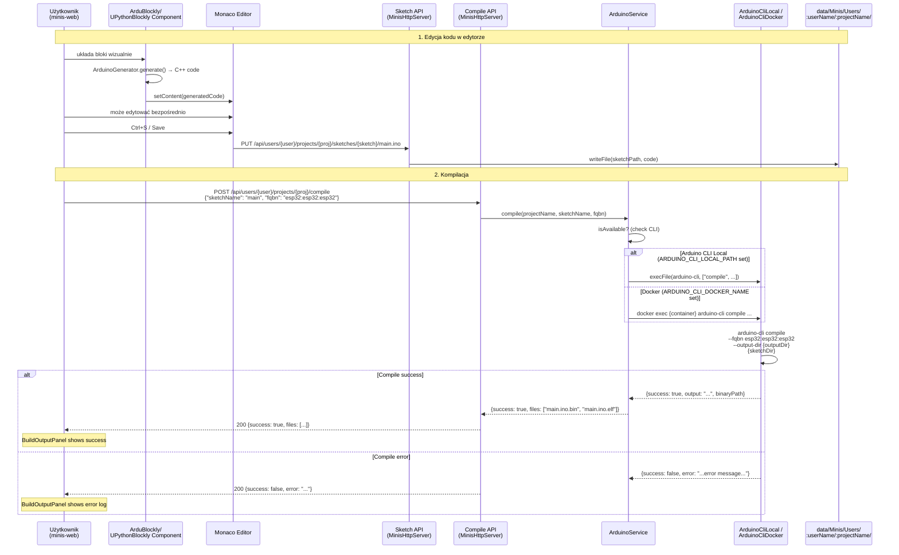
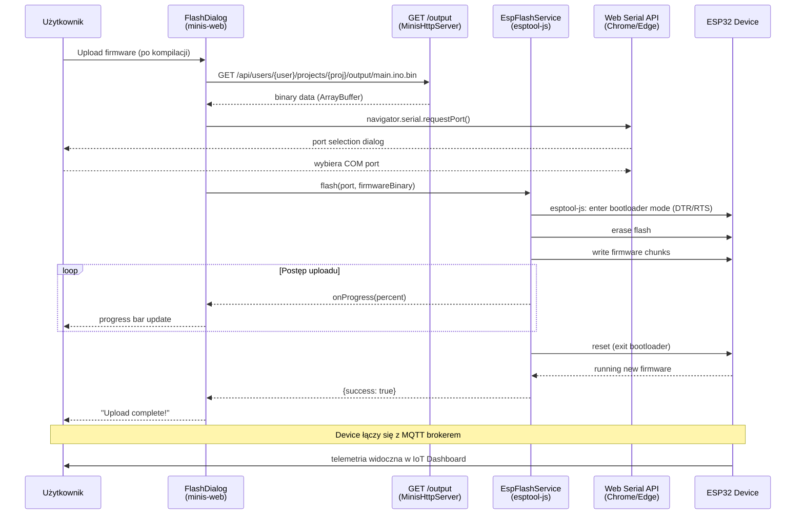
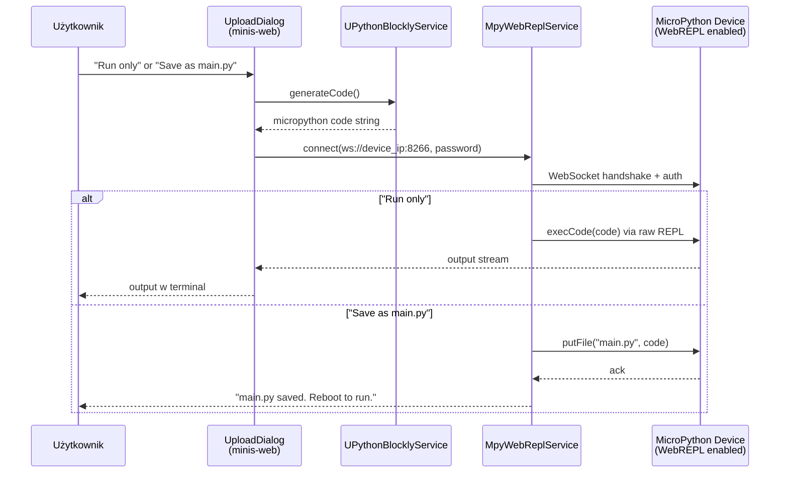

# Arduino Compilation & Upload Flow

Przepływ kompilacji i uploadu firmware Arduino/ESP32 przez Minis Platform.

## Kompilacja Sketcha



## Upload przez Serial (Web Serial API)



## Upload uPython przez WebREPL



## Środowiska Arduino CLI

| Env Variable | Tryb | Opis |
|---|---|---|
| `ARDUINO_CLI_LOCAL_PATH` | Local | Ścieżka do `arduino-cli` binarki na hoście |
| `ARDUINO_CLI_DOCKER_NAME` | Docker | Nazwa kontenera Docker z arduino-cli |
| (brak) | Unavailable | `ArduinoService.isAvailable = false` |

## Wspierane platformy

| FQBN | Board | Blockly Profile |
|------|-------|-----------------|
| `esp8266:esp8266:huzzah` | Adafruit Feather Huzzah | ESP8266 Huzzah |
| `esp8266:esp8266:d1_mini` | Wemos D1 Mini | Wemos D1 |
| `esp32:esp32:esp32` | ESP32 DevKitC | ESP32 |
| `arduino:avr:uno` | Arduino Uno | Arduino Uno |
| `arduino:avr:nano` | Arduino Nano | Arduino Nano |
| `arduino:avr:mega` | Arduino Mega | Arduino Mega |
| `arduino:avr:leonardo` | Arduino Leonardo | Arduino Leonardo |

## Ścieżki projektów (FileSystem)

```
data/Minis/Users/{userName}/{projectName}/
├── sketches/
│   └── {sketchName}/
│       ├── main.ino       # Arduino sketch
│       └── ...
├── output/                # Skompilowane binaria
│   ├── main.ino.bin       # Firmware binary
│   ├── main.ino.elf       # Debug ELF
│   └── ...
├── libraries/             # Lokalne biblioteki projektu
└── custom-config.yaml     # Custom arduino-cli config
```
