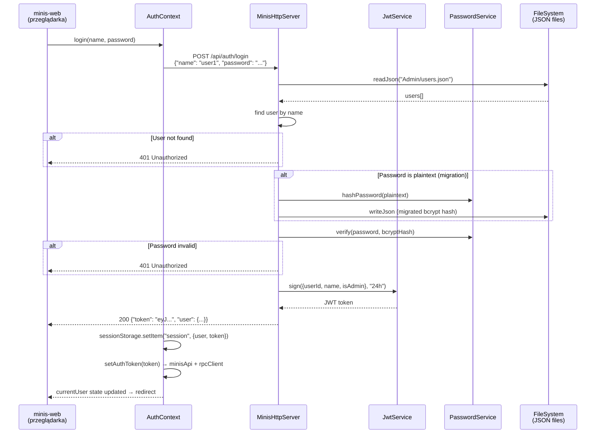
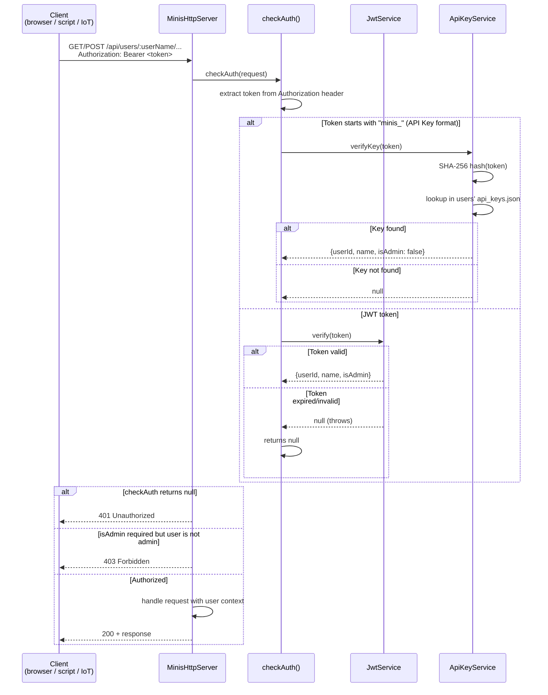
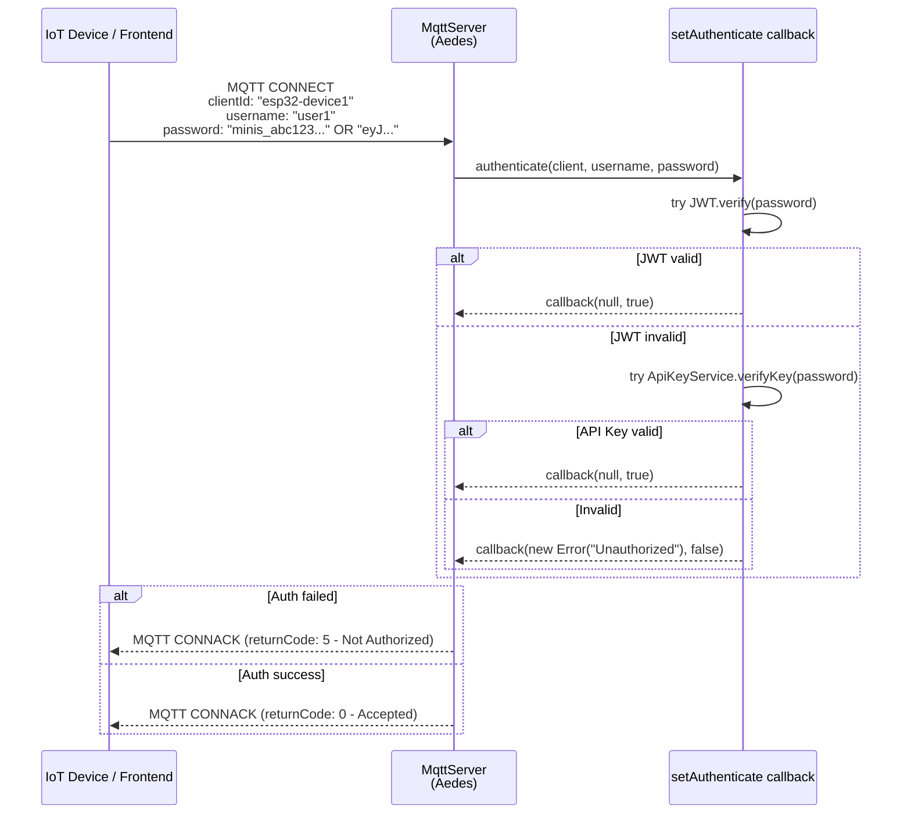
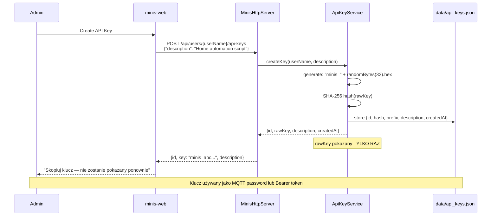

# Authentication Flow

Przepływ autentykacji w Minis Platform — JWT dla użytkowników, API Keys dla automatyzacji.

## Login Flow (JWT)

## Request Authentication (checkAuth middleware)

## MQTT Authentication

## API Key Management

## Publiczne endpointy (bez auth)

| Endpoint | Opis |
|----------|------|
| `POST /api/auth/login` | Logowanie, zwraca JWT |
| `GET /api/auth/users` | Lista użytkowników (bez haseł) — dla login page |
| `GET /api/docs*` | Swagger UI |
| `GET /api/docs/swagger.json` | OpenAPI spec |
