# C4 Level 3 — Components: minis-backend

Wewnętrzne komponenty aplikacji `minis-backend`.

```mermaid
C4Component
    title Components — minis-backend (app/minis-backend/src/)

    Person(client, "Klient HTTP", "minis-web / REST consumer")
    Person(mqttClient, "Klient MQTT", "IoT device / minis-web")

    Container_Boundary(minisBackend, "minis-backend") {

        Component(app, "App", "Singleton\nApp.ts", "Inicjalizacja i wiring\nwszystkich serwisów.\nGraceful shutdown.")

        Component(httpServer, "MinisHttpServer", "Node.js HTTP\nMinisHttpServer.ts", "REST API (/api/*)\nJWT auth middleware\nHandleCrud() generyczny CRUD\nSwagger UI (/api/docs)\nRPC dispatch (/api/rpc/*)\nVFS endpoints (/api/vfs/*)\nArduino + Sketch endpoints")

        Component(mqttServer, "MqttServer", "Aedes + ws\n(core-backend)", "MQTT broker embedded\nWebSocket path: /mqtt\nAuthentication callback\nPublish/Subscribe API")

        Component(rpcRouter, "RpcRouter", "rpc/RpcRouter.ts", "Rejestracja i dispatch\nhandlerów RPC.\nZod validation.\nPing, IoT methods.")

        Component(iotService, "IotService", "iot/IotService.ts", "Orchestrator IoT:\nParsowanie MQTT topics\n'minis/{user}/{device}/{type}'\nForwarding do shared users")

        Component(iotDatabase, "IotDatabase", "iot/IotDatabase.ts", "SQLite inicjalizacja\nWAL mode\nSchema migrations")

        Component(telemetryStore, "TelemetryStore", "iot/TelemetryStore.ts", "INSERT telemetrii\nQuery z filtrami (from/to/limit)\nAggregacja (min/max/avg)\nConfig CRUD per entity")

        Component(devicePresence, "DevicePresence", "iot/DevicePresence.ts", "Heartbeat tracking\nTimeout detection (30s)\nStatus: online/offline")

        Component(commandDispatcher, "CommandDispatcher", "iot/CommandDispatcher.ts", "Tworzenie komend\nACK/FAIL tracking\nKolejka komend per device")

        Component(alertEngine, "AlertEngine", "iot/AlertEngine.ts", "CRUD reguł alertów\nEwaluacja po każdej telemetrii\nCooldown między alertami\nPublikacja alertów MQTT")

        Component(deviceShareStore, "DeviceShareStore", "iot/DeviceShareStore.ts", "CRUD udostępnień urządzeń\nPrepared statements\nQuery: getSharesForDevice\ngetSharedWithUser")

        Component(arduinoService, "ArduinoService", "arduino/ArduinoService.ts", "Orchestrator:\nLocal (child_process)\nlub Docker (docker exec)\nCompile / Upload / ListBoards")

        Component(jwtService, "JwtService", "core-backend/auth", "Sign/verify JWT\njsonwebtoken")

        Component(apiKeyService, "ApiKeyService", "core-backend/auth", "CRUD API keys\nPrefix: minis_\nSHA-256 hash")

        Component(fileSystem, "FileSystem", "core-backend/filesystem", "In-memory cache JSON\nAtomic writes\nfileChanged EventEmitter")

        Component(swagger, "Swagger Builder", "swagger.ts", "buildSwaggerSpec()\nAuto-generate z Zod schemas\nzod-to-json-schema\nx-autocomplete/x-depends-on")
    }

    Rel(client, httpServer, "HTTP requests", "REST API")
    Rel(mqttClient, mqttServer, "MQTT connect/pub/sub", "WebSocket")

    Rel(app, httpServer, "tworzy i konfiguruje")
    Rel(app, mqttServer, "tworzy i konfiguruje")
    Rel(app, iotService, "tworzy, wiruje MQTT → IoT")
    Rel(app, arduinoService, "tworzy")
    Rel(app, jwtService, "tworzy")
    Rel(app, apiKeyService, "tworzy")
    Rel(app, fileSystem, "tworzy")

    Rel(httpServer, rpcRouter, "dispatch /api/rpc/*")
    Rel(httpServer, iotService, "IoT HTTP endpoints")
    Rel(httpServer, arduinoService, "compile/upload/listBoards")
    Rel(httpServer, jwtService, "checkAuth middleware")
    Rel(httpServer, apiKeyService, "checkAuth + CRUD keys")
    Rel(httpServer, fileSystem, "CRUD JSON data")
    Rel(httpServer, swagger, "GET /api/docs/swagger.json")

    Rel(mqttServer, iotService, "onMessage callback")
    Rel(iotService, telemetryStore, "store telemetry")
    Rel(iotService, devicePresence, "update presence")
    Rel(iotService, commandDispatcher, "ACK/FAIL commands")
    Rel(iotService, alertEngine, "evaluate alerts")
    Rel(iotService, deviceShareStore, "get shares for forwarding")
    Rel(iotService, mqttServer, "publish status/alerts/forward")
    Rel(telemetryStore, iotDatabase, "SQL queries")
    Rel(devicePresence, iotDatabase, "SQL queries")
    Rel(commandDispatcher, iotDatabase, "SQL queries")
    Rel(alertEngine, iotDatabase, "SQL queries")
    Rel(deviceShareStore, iotDatabase, "SQL queries")
```



## Kluczowe przepływy

### MQTT message routing (IotService)
```
minis/{user}/{device}/telemetry    → TelemetryStore.insert + AlertEngine.eval + DevicePresence.update
                                     + publishStatus + forwardToSharedUsers(telemetryLive)
minis/{user}/{device}/heartbeat    → DevicePresence.updateHeartbeat
minis/{user}/{device}/command/ack  → CommandDispatcher.ackCommand + publishStatus
minis/{user}/{device}/command/fail → CommandDispatcher.failCommand + publishStatus
```

### HTTP CRUD pattern (handleCrud)
```typescript
// Generyczna metoda — eliminuje duplikację między endpointami
handleCrud({ resource: 'users', fileKey: 'Admin/users.json', lookupKey: 'id' })
handleCrud({ resource: 'devices', fileKey: 'Users/:userName/devices.json', lookupKey: 'name' })
```

### RPC dispatch
```
POST /api/rpc/{methodName}
  → RpcRouter.dispatch(method, input, context)
  → Zod.parse(inputSchema)
  → handler(parsedInput, { iotService, fileSystem, user })
  → Zod.parse(outputSchema)
  → { result } lub { error }
```
