# C4 Level 3 — Components: minis-web

Moduły aplikacji frontendowej `minis-web`.

```mermaid
C4Component
    title Components — minis-web (app/minis-web/src/)

    Person(user, "Użytkownik")
    Person(admin, "Administrator")

    Container_Boundary(minisWeb, "minis-web (React 18 + Vite 6)") {

        Component(main, "main.tsx", "Entry point", "Provider tree:\nMqttProvider → FilesystemProvider\n→ MinisDataSourceProvider\n→ AuthProvider\n→ GlobalWindowsProvider")

        Component(appRoutes, "App.tsx + Routes", "React Router 6", "Route definitions\n/admin/:userName/*\n/user/:userName/*\nAdminOnly guard\nImpersonation banner")

        Component(layout, "Layout.tsx", "MUI Drawer + AppBar", "Sidebar navigation\nCollapsible groups\n(Electronics, IoT, Tools)\nAccountMenu\nImpersonationBanner")

        Component(authModule, "auth/", "AuthContext + Provider", "JWT login/logout\nsessionStorage\nsetAuthToken → API+RPC\nImpersonation state")

        Component(mqttModule, "mqttclient/", "Re-export web-client", "MqttProvider, useMqtt\nWebSocket MQTT")

        Component(filesystemModule, "filesystem/", "Minis-specific", "FileModel, DirNode\nFilesystemContext\nMinisDataSourceContext\n(MemoryDataSource via MQTT)")

        Component(minisApiService, "MinisApiService.ts", "REST client singleton", "minisApi\n30+ metod: CRUD users,\ndeviceDefs, IoT, Arduino,\nAPI keys, Sketch, VFS")

        Component(rpcClient, "RpcClient.ts", "Type-safe RPC", "rpcClient\ncall<TName>(method, input)\nFull type inference\nPOST /api/rpc/{method}")

        Component(ardublockly, "ardublockly2/", "Blockly + Arduino", "ArduBlocklyService\nC++ code generator\nBoard profiles\n(ESP8266/ESP32/Arduino)")

        Component(upythonblockly, "upythonblockly/", "Blockly + uPython", "UPythonBlocklyService\nMicroPython generator\nRepl terminal (Serial+WebREPL)\nUpload dialog")

        Component(serialModule, "serial/", "Web Serial API", "WebSerialService\nWebSerialTerminal (xterm)\nEspFlashService (esptool-js)\nFlashDialog")

        Component(iotEmulator, "iot-emulator/", "In-browser emulator", "EmulatorService\nMQTT pub/sub (mqtt v5)\nPresety urządzeń\nlocalStorage persistence")

        Component(globalWindows, "GlobalWindowsContext\n+ GlobalWindows", "Floating windows", "ApiDocs (Swagger UI)\nRpcExplorer (auto-forms)\nMqttExplorer (topic tree)\nMjdDefEditor\nMjdDataEditor")

        Component(pagesAdmin, "pages/admin/", "Admin pages", "Users, DeviceDefs,\nModuleDefs, ProjectDefs\nFilesystem, CRUD")

        Component(pagesUser, "pages/user/", "User pages", "Devices, Projects,\nuPython Projects\nProjectPage (Blockly+Monaco)\nuPythonProjectPage\nIoT Dashboard/Devices/Alerts\nEmulator")

        Component(pagesTools, "pages/user/tools/", "Tool pages (AdminOnly)", "RpcExplorer\nMqttExplorer\nApiKeys\nTestVfs\nDocs (TypeDoc viewer)\nMonaco Editor")
    }

    Container_Ext(minisBackend, "minis-backend", "Port 1902")

    Rel(user, appRoutes, "nawiguje")
    Rel(admin, appRoutes, "nawiguje (admin routes)")

    Rel(main, mqttModule, "provides MqttContext")
    Rel(main, authModule, "provides AuthContext")
    Rel(main, globalWindows, "provides GlobalWindowsContext")

    Rel(appRoutes, layout, "renders w Layout")
    Rel(appRoutes, pagesAdmin, "renders /admin/*")
    Rel(appRoutes, pagesUser, "renders /user/*")
    Rel(appRoutes, pagesTools, "renders /tools/*")

    Rel(authModule, minisApiService, "setAuthToken()")
    Rel(authModule, rpcClient, "setAuthToken()")

    Rel(pagesAdmin, minisApiService, "CRUD calls")
    Rel(pagesUser, minisApiService, "IoT + Arduino calls")
    Rel(pagesTools, rpcClient, "RPC calls")

    Rel(pagesUser, ardublockly, "Arduino projects")
    Rel(pagesUser, upythonblockly, "uPython projects")
    Rel(pagesUser, serialModule, "Serial terminal + flash")
    Rel(pagesUser, iotEmulator, "IoT emulator")

    Rel(mqttModule, minisBackend, "MQTT over WebSocket")
    Rel(minisApiService, minisBackend, "HTTP REST /api/*")
    Rel(rpcClient, minisBackend, "HTTP POST /api/rpc/*")
```



## Routing z :userName

Wszystkie ścieżki zawierają `:userName` dla multi-user support:

```
/admin/:userName/main
/admin/:userName/users
/admin/:userName/devicesdefs
/user/:userName/iot/dashboard
/user/:userName/electronics/arduino
/user/:userName/project/:projectId
/user/:userName/tools/rpc
```

## Impersonacja (Admin)

```
Admin zalogowany → /admin/adminName/users
→ Klik "Impersonate" na użytkownika X
→ AuthContext.startImpersonating(userX)
→ ImpersonationBanner pokazuje "Viewing as: X"
→ Redirect → /user/X/main
→ stopImpersonating() → powrót do /admin/adminName/main
```
