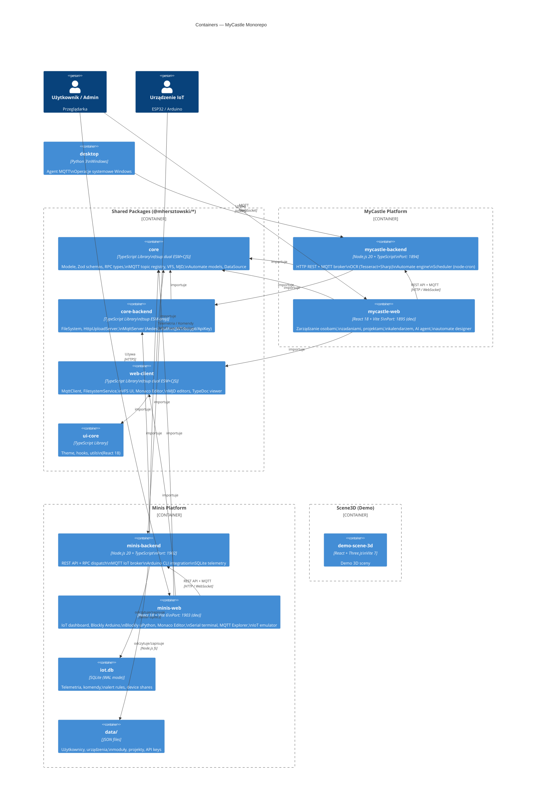

# C4 Level 2 — Containers

Diagram pokazuje wszystkie aplikacje i pakiety monorepo z ich zależnościami.

## Porty i protokoły

| Aplikacja | Port | Protokoły |
|-----------|------|-----------|
| mycastle-backend | 1894 | HTTP REST, MQTT over WebSocket (`/mqtt`) |
| mycastle-web | 1895 (dev) | HTTP (Vite HMR) |
| minis-backend | 1902 | HTTP REST, MQTT over WebSocket (`/mqtt`), WS Terminal (`/ws/terminal`) |
| minis-web | 1903 (dev) | HTTP (Vite HMR), proxy `/api` → 1902, `/mqtt` → ws:1902 |

## Wersje runtime

| Technologia | Wersja |
|-------------|--------|
| Node.js | 20.x |
| TypeScript | 5.9+ |
| React | 18 (MyCastle: MUI 5, Minis: MUI 6) |
| Vite | 5 (mycastle-web), 6 (minis-web), 7 (scene3d) |
| pnpm | 10.28.2 |
| SQLite | via better-sqlite3 |
