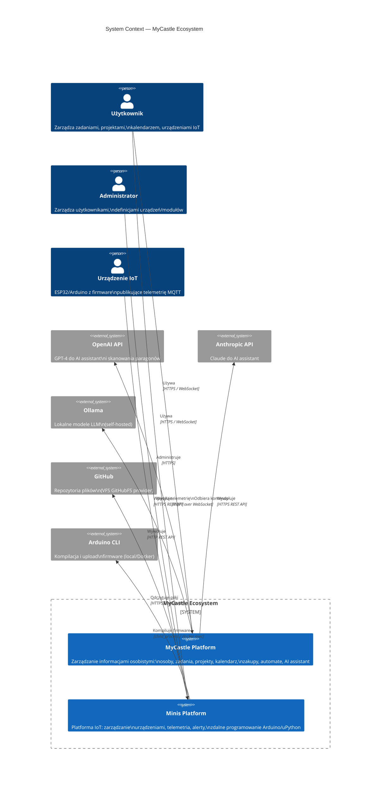

# C4 Level 1 — System Context

Diagram pokazuje MyCastle jako system w kontekście zewnętrznych aktorów i systemów.

## Aktorzy

| Aktor | Rola |
|-------|------|
| **Użytkownik** | Korzysta z obu platform przez przeglądarkę. W Minis ma swoje urządzenia, projekty IoT, dashboard telemetrii |
| **Administrator** | Zarządza definicjami urządzeń, modułów, projektów. Może impersonować innych użytkowników |
| **Urządzenie IoT** | Mikrokontroler (ESP32, Arduino) z firmware publikujący dane MQTT. Reaguje na komendy |

## Systemy zewnętrzne

| System | Użycie |
|--------|--------|
| **OpenAI API** | AI assistant (tool calling), skanowanie paragonów (Vision API) |
| **Anthropic API** | AI assistant (Claude models) |
| **Ollama** | Lokalne LLM dla prywatności danych |
| **GitHub** | VFS provider — pliki z repozytoriów GitHub w Monaco Editor |
| **Arduino CLI** | Kompilacja `.ino` sketchy, upload przez port COM/Serial |
