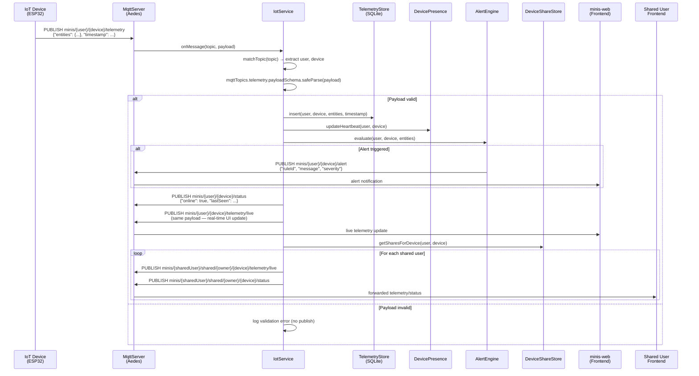
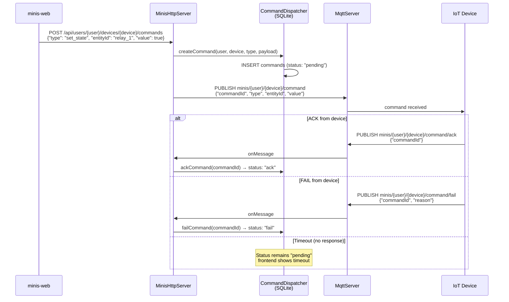
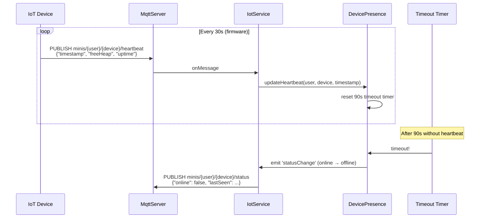

# MQTT IoT Data Flow

Przepływ danych telemetrii od urządzenia IoT przez backend do frontendu.

## Pipeline telemetrii

## Przepływ komendy

## Heartbeat i Presence

## Topic Schema

| Topic Pattern | Kierunek | Payload |
|---------------|----------|---------|
| `minis/{user}/{device}/telemetry` | IoT → Backend | `{entities: {...}, timestamp}` |
| `minis/{user}/{device}/telemetry/live` | Backend → Frontend | same (re-publish) |
| `minis/{user}/{device}/heartbeat` | IoT → Backend | `{timestamp, freeHeap, uptime}` |
| `minis/{user}/{device}/status` | Backend → Frontend | `{online, lastSeen}` |
| `minis/{user}/{device}/command` | Backend → IoT | `{commandId, type, entityId, value}` |
| `minis/{user}/{device}/command/ack` | IoT → Backend | `{commandId}` |
| `minis/{user}/{device}/command/fail` | IoT → Backend | `{commandId, reason}` |
| `minis/{user}/{device}/alert` | Backend → Frontend | `{ruleId, message, severity}` |
| `minis/{target}/shared/{owner}/{device}/telemetry/live` | Backend → SharedUser | forwarded telemetry |
| `minis/{target}/shared/{owner}/{device}/status` | Backend → SharedUser | forwarded status |
