# Graf Zależności Pakietów

Zależności między pakietami i aplikacjami w monorepo MyCastle.

```mermaid
graph TD
    subgraph packages ["Shared Packages (@mhersztowski/*)"]
        core["@mhersztowski/core<br/><small>models, Zod, RPC, MQTT types<br/>VFS, MJD, automate, datasource</small>"]
        uiCore["@mhersztowski/ui-core<br/><small>hooks, theme, utils</small>"]
        coreBackend["@mhersztowski/core-backend<br/><small>FileSystem, HttpUploadServer<br/>MqttServer (Aedes), Auth</small>"]
        webClient["@mhersztowski/web-client<br/><small>MqttClient, FilesystemService<br/>VFS UI, Monaco Editor, MJD editors</small>"]
        coreScene3d["@mhersztowski/core-scene3d<br/><small>SceneGraph, RenderEngine, Three.js</small>"]
        uiScene3d["@mhersztowski/ui-components-scene3d<br/><small>3D UI: panels, toolbar, RichEditor</small>"]
    end

    subgraph apps ["Applications"]
        mcBackend["mycastle-backend<br/><small>Node.js 1894<br/>OCR, Automate, Scheduler</small>"]
        mcWeb["mycastle-web<br/><small>React+Vite 1895<br/>Personal info management</small>"]
        minisBackend["minis-backend<br/><small>Node.js 1902<br/>IoT, Arduino, RPC, REST</small>"]
        minisWeb["minis-web<br/><small>React+Vite 1903<br/>IoT dashboard, Blockly</small>"]
        demoScene["demo-scene-3d<br/><small>React+Three.js demo</small>"]
        desktop["desktop<br/><small>Python MQTT agent</small>"]
    end

    subgraph external ["External Dependencies (selected)"]
        aedes["aedes<br/><small>MQTT broker</small>"]
        zod["zod<br/><small>schema validation</small>"]
        sqlite["better-sqlite3<br/><small>IoT telemetry DB</small>"]
        blockly["blockly 12<br/><small>visual programming</small>"]
        monaco["monaco-editor<br/><small>code editor</small>"]
        three["three.js<br/><small>3D rendering</small>"]
        mui5["MUI 5<br/><small>UI components</small>"]
        mui6["MUI 6<br/><small>UI components</small>"]
        tesseract["tesseract.js<br/><small>OCR</small>"]
        pahomqtt["paho-mqtt<br/><small>Python MQTT</small>"]
    end

    %% Package internal deps
    coreBackend --> core
    coreBackend --> aedes
    webClient --> core
    webClient --> uiCore
    webClient --> monaco
    coreScene3d --> uiCore
    coreScene3d --> three
    uiScene3d --> coreScene3d
    uiScene3d --> uiCore
    core --> zod

    %% App → package deps
    mcBackend --> core
    mcBackend --> coreBackend
    mcBackend --> tesseract

    mcWeb --> core
    mcWeb --> webClient
    mcWeb --> mui5

    minisBackend --> core
    minisBackend --> coreBackend
    minisBackend --> sqlite

    minisWeb --> core
    minisWeb --> webClient
    minisWeb --> blockly
    minisWeb --> mui6

    demoScene --> coreScene3d
    demoScene --> uiScene3d
    demoScene --> uiCore

    desktop --> pahomqtt

    %% Styling
    classDef pkg fill:#4a90d9,stroke:#2c6fad,color:#fff
    classDef app fill:#5cb85c,stroke:#3d8b3d,color:#fff
    classDef ext fill:#f0ad4e,stroke:#c87d00,color:#fff

    class core,coreBackend,webClient,uiCore,coreScene3d,uiScene3d pkg
    class mcBackend,mcWeb,minisBackend,minisWeb,demoScene,desktop app
    class aedes,zod,sqlite,blockly,monaco,three,mui5,mui6,tesseract,pahomqtt ext
```



## Reguła warstw

```
external libraries
       ↑
  @mhersztowski/core (no internal deps)
       ↑
  @mhersztowski/core-backend    @mhersztowski/ui-core
  @mhersztowski/web-client ────────────────↗
       ↑
  applications (mycastle-*, minis-*, demo-*, desktop)
```

**Zakaz:** Aplikacja nie może importować z innej aplikacji. Pakiet `core` nie może importować z `core-backend` ani `web-client`.

## Wersje kluczowych zależności

| Pakiet | Wersja | Gdzie |
|--------|--------|-------|
| zod | ^3.x | core, core-backend |
| aedes | ^2.x | core-backend |
| better-sqlite3 | ^9.x | minis-backend |
| blockly | ^12.x | minis-web |
| monaco-editor | ^0.50+ | web-client (peer) |
| three | ^0.x | core-scene3d |
| MUI | 5 (mcWeb), 6 (minisWeb) | apps |
| React | 18 | all frontends |
| Vite | 5 (mcWeb), 6 (minisWeb), 7 (scene3d) | apps |
